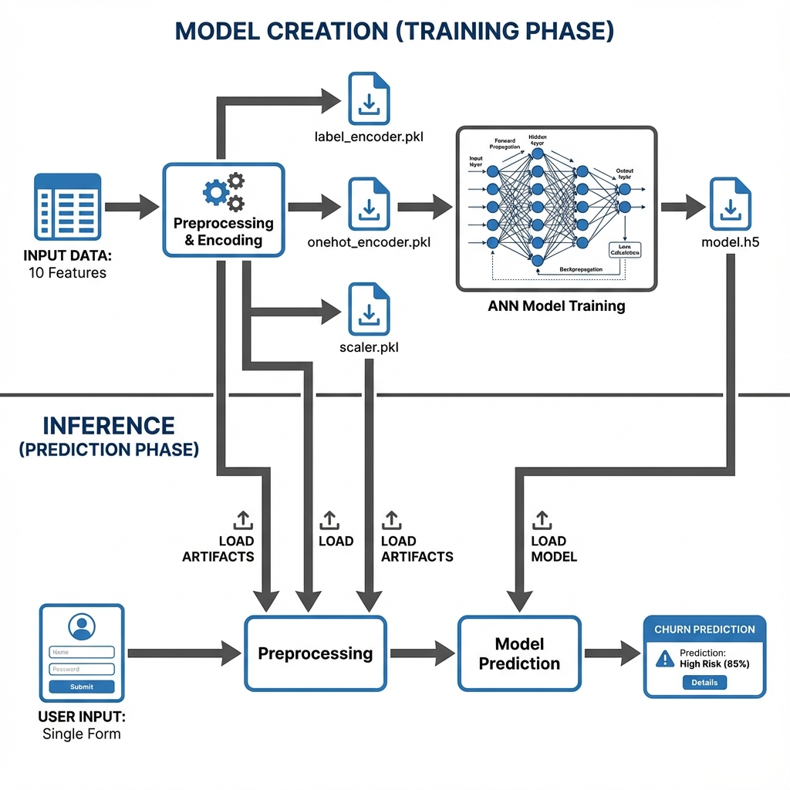

# Customer Churn Prediction (ANN)



This project uses an Artificial Neural Network (ANN) to predict customer churn based on various features. The model predicts whether a customer is likely to leave the bank based on their demographic and account information.

## Project Structure

The project is organized into the following directories:

```
ANN/
├── .github/
│   └── workflows/
│       └── ci.yml                # GitHub Actions CI/CD pipeline
├── data/                          # Data files
│   ├── Churn_Modelling.csv       # Training dataset
│   └── realtime_example.csv      # Example format for real-time predictions
├── models/                        # Trained models and preprocessors
│   ├── model.h5                  # Trained ANN model
│   ├── scaler.pkl                # StandardScaler for feature scaling
│   ├── label_encoder_gender.pkl  # Label encoder for Gender
│   └── onehot_encoder_geo.pkl    # One-hot encoder for Geography
├── notebooks/                     # Jupyter notebooks
│   ├── ANN.ipynb                 # Main notebook for building and training the ANN
│   └── prediction.ipynb          # Notebook for making predictions
├── src/                          # Source code
│   └── app.py                    # Streamlit web application
├── tests/                        # Test files
│   ├── __init__.py
│   └── test_app.py               # Unit tests for the application
├── .flake8                       # Flake8 linting configuration
├── .gitignore                    # Git ignore rules
├── Makefile                      # Make commands for development
├── pytest.ini                    # Pytest configuration
├── pyproject.toml                # Python project configuration
├── requirements.txt              # Python dependencies
├── requirements-dev.txt          # Development dependencies
└── README.md                     # This file
```

## Setup and Installation

### Prerequisites
- Python 3.8 or higher
- pip (Python package manager)

### Step 1: Install Dependencies

Install all required packages using pip:

```bash
pip install -r requirements.txt
```

**Note**: If you encounter a `ModuleNotFoundError: No module named 'sklearn'`, make sure scikit-learn is installed:
```bash
pip install scikit-learn
```

### Step 2: Verify Model Files

Ensure all model files exist in the `models/` directory:
- `model.h5`
- `scaler.pkl`
- `label_encoder_gender.pkl`
- `onehot_encoder_geo.pkl`

If these files are missing, you'll need to train the model first (see Model Training section).

## How to Run

### Running the Streamlit Application

1. **Navigate to the project root directory**:
   ```bash
   cd ANN
   ```

2. **Run the Streamlit app**:
   ```bash
   streamlit run src/app.py
   ```

3. **Access the application**:
   - The app will automatically open in your default web browser
   - If it doesn't, navigate to `http://localhost:8501` in your browser

4. **Use the application**:
   - Fill in the customer information using the form controls
   - Click anywhere to see the churn prediction
   - The prediction shows both the probability and a binary classification

### Running the Jupyter Notebooks

1. **Start Jupyter Notebook**:
   ```bash
   jupyter notebook
   ```

2. **Open the desired notebook**:
   - `notebooks/ANN.ipynb` - For training the model
   - `notebooks/prediction.ipynb` - For making predictions programmatically

## Model Training

To retrain the model from scratch:

1. Open `notebooks/ANN.ipynb` in Jupyter Notebook
2. Run all cells sequentially
3. Ensure the generated files are saved to the `models/` directory:
   - `model.h5` - The trained model
   - `scaler.pkl` - The fitted StandardScaler
   - `label_encoder_gender.pkl` - The fitted LabelEncoder for Gender
   - `onehot_encoder_geo.pkl` - The fitted OneHotEncoder for Geography

**Important**: After training, move all generated `.pkl` and `.h5` files to the `models/` directory.

## Realtime Data Format

For real-time predictions, your input data should follow this CSV format:

### Required Columns:
- `CreditScore` (integer): Credit score of the customer (typically 350-850)
- `Geography` (string): Country of residence - must be one of: `France`, `Germany`, or `Spain`
- `Gender` (string): Gender - must be either `Male` or `Female`
- `Age` (integer): Age of the customer (typically 18-92)
- `Tenure` (integer): Number of years the customer has been with the bank (0-10)
- `Balance` (float): Account balance
- `NumOfProducts` (integer): Number of bank products the customer uses (1-4)
- `HasCrCard` (integer): Whether the customer has a credit card (0 or 1)
- `IsActiveMember` (integer): Whether the customer is an active member (0 or 1)
- `EstimatedSalary` (float): Estimated salary of the customer

### Example Realtime Data File

See `data/realtime_example.csv` for a complete example:

```csv
CreditScore,Geography,Gender,Age,Tenure,Balance,NumOfProducts,HasCrCard,IsActiveMember,EstimatedSalary
650,France,Male,35,5,125000.50,2,1,1,75000.00
720,Germany,Female,42,3,85000.25,1,1,0,95000.00
580,Spain,Male,28,7,50000.00,3,0,1,55000.00
```

### Using Realtime Data

You can modify `notebooks/prediction.ipynb` to read from a CSV file and make batch predictions:

```python
import pandas as pd
# Load your realtime data
realtime_data = pd.read_csv('data/realtime_example.csv')
# Process and predict for each row
```

## Usage

### Streamlit Web Interface

1. Launch the app using `streamlit run src/app.py`
2. Fill in the customer information:
   - **Geography**: Select from dropdown (France, Germany, Spain)
   - **Gender**: Select from dropdown (Male, Female)
   - **Age**: Use slider (18-92)
   - **Balance**: Enter account balance
   - **Credit Score**: Enter credit score
   - **Estimated Salary**: Enter estimated salary
   - **Tenure**: Use slider (0-10 years)
   - **Number of Products**: Use slider (1-4)
   - **Has Credit Card**: Select 0 (No) or 1 (Yes)
   - **Is Active Member**: Select 0 (No) or 1 (Yes)
3. View the prediction:
   - **Churn Probability**: A value between 0 and 1
   - **Prediction**: Binary classification (likely to churn or not)

### Programmatic Usage

See `notebooks/prediction.ipynb` for examples of making predictions programmatically.

## Troubleshooting

### ModuleNotFoundError: No module named 'sklearn'
**Solution**: Install scikit-learn:
```bash
pip install scikit-learn
```

### FileNotFoundError: model files not found
**Solution**: Ensure all model files exist in the `models/` directory. If missing, train the model using `notebooks/ANN.ipynb`.

### Import errors
**Solution**: Make sure all dependencies are installed:
```bash
pip install -r requirements.txt
```

## Dependencies

### Production Dependencies
- **tensorflow** (>=2.20.0): Deep learning framework
- **pandas** (>=2.0.0): Data manipulation
- **numpy** (>=1.24.0): Numerical computing
- **scikit-learn** (>=1.3.0): Machine learning utilities
- **streamlit** (>=1.40.0): Web application framework
- **matplotlib** (>=3.7.0): Plotting library
- **tensorboard** (>=2.20.0): TensorFlow visualization

### Development Dependencies
- **pytest** (>=7.4.0): Testing framework
- **pytest-cov** (>=4.1.0): Coverage reporting
- **flake8** (>=6.1.0): Linting
- **black** (>=23.11.0): Code formatting
- **safety** (>=2.3.0): Security scanning

## CI/CD Pipeline

This project includes a GitHub Actions CI/CD pipeline that automatically:

- **Lints code** using flake8
- **Checks code formatting** using Black
- **Runs tests** using pytest with coverage reporting
- **Verifies imports** and model file existence
- **Tests on multiple Python versions** (3.10, 3.11, 3.12)
- **Performs security scans** on dependencies

### Running CI Checks Locally

You can run the same checks locally using the Makefile:

```bash
# Install development dependencies
make install-dev

# Run all CI checks
make ci

# Or run individual checks
make test      # Run tests
make lint      # Run linters
make format    # Format code
make format-check  # Check formatting without modifying
```

### GitHub Actions Workflow

The CI pipeline runs automatically on:
- Push to `main` or `develop` branches
- Pull requests to `main` or `develop` branches

View the workflow file at `.github/workflows/ci.yml`

## Development

### Running Tests

```bash
# Install development dependencies
pip install -r requirements-dev.txt

# Run tests
pytest tests/ -v

# Run tests with coverage
pytest tests/ -v --cov=src --cov-report=html
```

### Code Quality

```bash
# Format code
black src/ tests/

# Check formatting
black --check src/ tests/

# Lint code
flake8 src/
```

## License

This project is for educational purposes.


